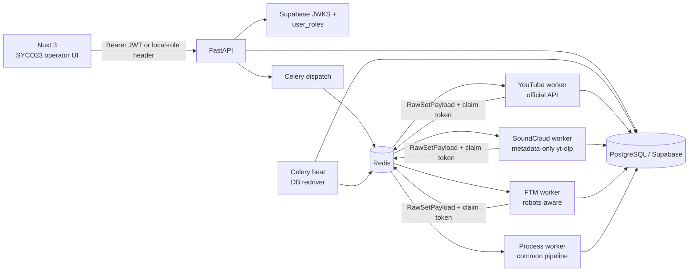
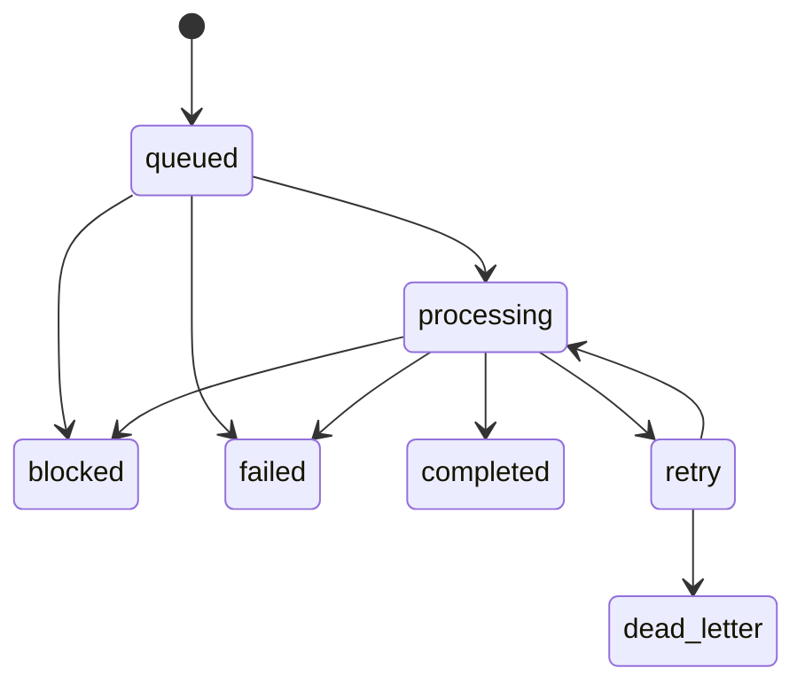
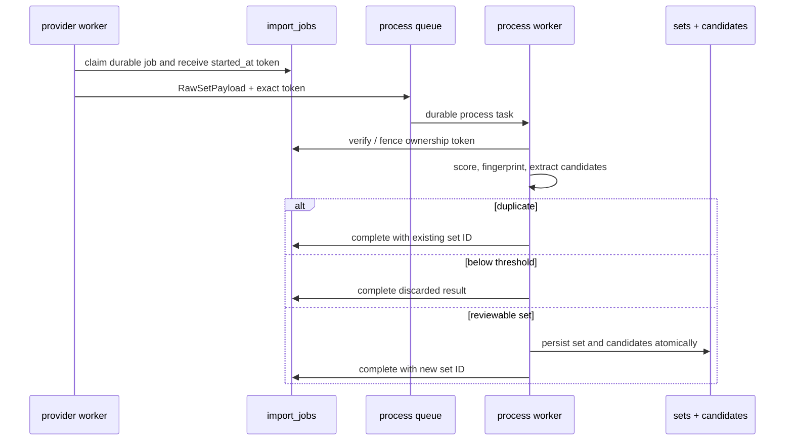

# SYCO23 SETCRAWLER v0.2 Architecture

SYCO23 is the public editorial surface of the SYSTEM CORRUPT set-discovery
system. PostgreSQL is the source of truth. The application captures provider
metadata for possible live sets, produces reviewable evidence, and requires an
editorial action before public publication.

## Runtime topology

The web UI calls FastAPI, rather than reading editorial tables directly. In
production the API validates Supabase JWTs using the Supabase JWKS endpoint,
then reads the application role from `user_roles`. The only supported roles are
`viewer`, `editor`, and `admin`. Local header authentication is explicitly
non-production; configuration rejects it when `ENVIRONMENT=production`.

## Persistence and migrations

Core sets, relations, candidates, images, audit records, profiles and
heuristic configuration live in the base schema. The v0.2 migration adds
`import_jobs`, `provider_cursors`, operational indexes, RLS policies and
explicit grants. Production Supabase installation order is:

1. `0001_init.sql`
2. `0002_rls.sql`
3. `0003_indexes.sql`
4. `20260728192205_provider_jobs.sql`
5. `20260729060000_final_release_fixes.sql`

Docker Compose is a local PostgreSQL compatibility path, not a replacement for
Supabase. It provisions `auth.uid()` and required roles, then mounts `0001`,
`0003`, the provider-job migration, and the final release migration. It
deliberately excludes `0002_rls`.

Search profiles are an administrative control surface: their RLS write policy
is admin-only. Deletion is a transactional soft delete. It returns a conflict
while a queued, processing, or retry job still references the profile; after
all jobs are terminal, the profile disappears from API lists while its job
history and foreign-key identity remain intact.

## Job state and delivery model

Each durable job records source, type, input, attempts, timestamps, result set
and diagnostic detail. Retry delays are 5, 30 and 120 seconds; a fourth
failure becomes `dead_letter`. Workers claim before fetching/processing and
use `started_at` as an ownership token. The claim lease prevents an abandoned
worker from blocking recovery forever, and compare-and-set transitions stop a
late worker from overwriting the replacement's outcome.

Delivery recovery is part of the task protocol:

- API dispatch failure changes the just-created queued job to a safe terminal
  failure before returning `503`; it does not leave an undelivered active job.
- tasks are late-acknowledged, reject on worker loss, and are not acknowledged
  on failure or timeout, so a worker crash returns the delivery to the broker;
- an early duplicate delivery does not call a provider. It schedules the same
  provider task for the remaining lease interval; a publish failure leaves the
  current delivery unacknowledged;
- a retry row is not claimable before its durable `next_retry_at`, and its
  failure count remains in PostgreSQL even if Celery recreates the message;
- provider results are published to the process queue with the exact
  `started_at` token. A stale process delivery is fenced, while a worker-lost
  delivery is redelivered;
- YouTube profile pages checkpoint immutable child jobs. A separate finalizer
  polls their durable outcomes and fences its parent token.

Redis AOF reduces message loss during ordinary restarts, but PostgreSQL remains
authoritative. Celery beat scans a bounded batch of queued, due-retry, and
lease-expired processing rows every 60 seconds and republishes them to the
provider queues. This closes the recovery gap after total Redis data loss.
Concurrent or duplicate redrive publications are harmless because only one
worker can obtain the database claim.

Idempotency is enforced at several levels:

- direct jobs return their existing completed result;
- YouTube profile children are unique by parent job and provider source ID;
- set persistence locks and checks provider identity, canonical URL and a
  title/duration fingerprint;
- profile cursor checkpoints allow recovery without losing a received page.

## Provider boundaries

| Provider | Entry point | Runtime rules |
| --- | --- | --- |
| YouTube | enabled search profile or direct YouTube URL | Official Data API v3; `search.list` plus details; key is server-only; fixture mode is default. |
| SoundCloud | manually submitted URL | Strict `https://soundcloud.com/<artist>/<track>` validation; one metadata-only `yt-dlp` process; no downloads; 30-second and 1 MiB stream limits. |
| FTM | valid set-page URL/crawl task | Disabled unless opted in; HTTPS set pages only; fresh robots check before requests; named User-Agent; 5–10 second delay between every HTTP request, including robots/page boundaries; maximum 25 pages. |

All three adapters produce the common `RawSetPayload` contract and no adapter
stores copyrighted audio or video. Provider work is not activated by ordinary
fixture tests or CI.

## Common processing flow

Provider workers only fetch and adapt provider metadata. They never invoke the
common processing pipeline inline. The process worker owns scoring,
fingerprinting, candidate extraction, duplicate resolution, and persistence.
The heuristic scorer has configurable duration thresholds, keywords and known
metadata. It can create an inbox record but cannot publish it. Candidate
acceptance moves a record into review; publishing is a separate explicit API
operation and must be performed by an authorised editor/admin. This
non-publication invariant is independent of provider score and worker result.

## Security and operation

- `SUPABASE_SERVICE_ROLE_KEY`, `YOUTUBE_API_KEY`, `DATABASE_URL`, and provider
  credentials remain server/worker-only. Nuxt receives only public Supabase
  URL/anonymous key configuration.
- The SoundCloud container is non-root. Compose adds read-only root storage,
  a noexec tmpfs, one CPU and 512 MiB memory; the application still validates
  URL, subprocess arguments, time and output size.
- FTM treats robots retrieval failure as a block and does not follow a page
  before robots allows it.
- RLS and grants are both applied because Data API exposure is not assumed from
  RLS alone.
- Image storage buckets are private. v0.2 does not yet run image-download,
  pHash or OCR workers.

## Observability surfaces

`GET /health` verifies API reachability. Authenticated operator endpoints
expose provider capability state, durable import queue pages, individual job
diagnostics and aggregate stats. The web dashboard and `/imports` present this
state, with retry controls restricted to administrators for terminal failures.
